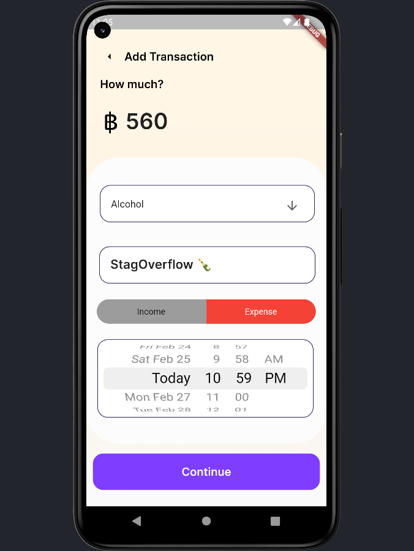

# Expense tracker

## Why?
As a student, it's a pain to keep track of money (since you are always spending it). Have you ever spend so much that the next time you open up your online banking app, you see this:

This is because you aren't keeping track of how much you are spending and how much you could spend and that are my pain points.

## My Pain Points
- Can't easily tell how much I've spent
- Can't easily tell how much I *could* spend
- No easy way for me to set a budget for myself

## App Design
Credits where credit's due, my design is based on ["MoneyManagamnetAPP" by Vishnu Pv](https://www.figma.com/community/file/1139434359785151402) on figma, this design is not too over the top and it's very minimal.
### App Scope / Features:
- Tell me how much I've spent
- Tell me how much I have left (to spend more)
- Keep track of my transaction history
- User able to Add/Delete transaction history
- User able to reset transaction history
- Data persist even if app is restarted

## Home Screen
My intention here is to make everything minimal so user can navigate the app easily without having to read/search the manual/internet.

### My final design on the homescreen:
note: all numbers are imaginary

You could click on the green 'Income' button and you could set your income per month (your budget per month, if you like)

On the home screen, by pressing the plus button on the top right, you'll be able to add a new transaction.

Home Screen             |  Add Screen
:-------------------------:|:-------------------------:
  |  

After filling in all the required information (left), press 'continue' and it should pop up in your home screen (right)

Add Screen Filled            |  Home Screen
:-------------------------:|:-------------------------:
  |  

On the home screen, by pressing the menu button on the top left, you'll be able to access the trasaction list page.

Home Screen            |  Transaction Screen
:-------------------------:|:-------------------------:
  |  

You can reset the transaction history by pressing the reset button on the top right of the transaction screen, then press 'clear' if you want to reset all transaction.

Transaction Screen            |  Transaction Screen
:-------------------------:|:-------------------------:
  |  

To delete a specific transaction history press on one, then a confirmation will appear. (you can press both in transaction screen and home screen)

Transaction Screen            |  Home Screen
:-------------------------:|:-------------------------:
  |  
